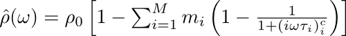

Cole-Cole fit
=============

This python package provides a command line interface to fit complex
resistivity/resistance data using the Cole-Cole model (Cole and Cole, 1941),
including multiple additive terms:

This resistivity formulation is based on Pelton et. al. 1978. The fit is
conducted using a non-linear least squares algorithm implemented in the scipy
package (scipy.optimize.leastsq).

The program is maintained (and updated) on the github page found here:
https://github.com/m-weigand/Cole-Cole-fit.git

References:

* Cole, K. and R. Cole (1941). Dispersion and absorption in dielectrics i.
  alternating current characteristics. Journal of Chemical Physics 9, 341–351.
* Pelton, W., S. Ward, P. Hallof, W. Sill, and P. Nelson (1978). Mineral
  discrimination and removal of inductive coupling with multifrequency IP.
  Geophysics 43 (3), 588–609.

Installation/Documentation
--------------------------

Please refer to the documentation in the ``doc/`` subdirectory (composed using
sphinx).
