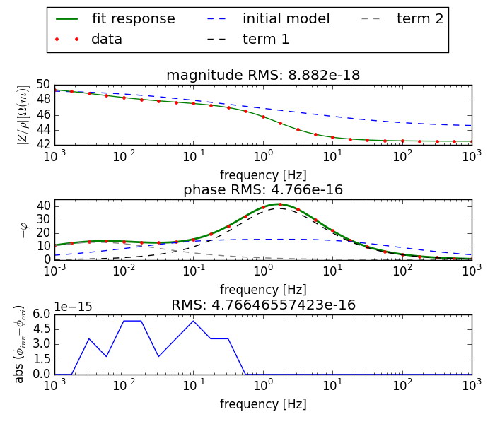

.. Cole-Cole Fit documentation master file, created by
   sphinx-quickstart on Mon Feb 23 17:17:21 2015.
   You can adapt this file completely to your liking, but it should at least
   contain the root `toctree` directive.

Welcome to Cole-Cole Fit's documentation!
=========================================

Introduction
------------

This python package provides a command line interface to fit complex
resistivity/resistance data using the Cole-Cole model (Cole and Cole, 1941),
including multiple additive terms:

.. math::

    \hat{\rho}(\omega) = \rho_0 \left[ 1 - \sum_{i=1}^M m_i \left( 1 -
    \frac{1}{1 + (i \omega \tau_i)^c_i} \right) \right]

This resitivity formulation is based on Pelton et. al. 1978. The fit is
conducted using a non-linear least squares algorithm implemented in the scipy
package (scipy.optimize.leastsq).

The program is maintained (and updated) on the github page found here:
https://github.com/m-weigand/Cole-Cole-fit.git

References:

* Cole, K. and R. Cole (1941). Dispersion and absorption in dielectrics i.
  alternating current characteristics. Journal of Chemical Physics 9, 341–351.
* Pelton, W., S. Ward, P. Hallof, W. Sill, and P. Nelson (1978). Mineral
  discrimination and removal of inductive coupling with multifrequency ip.
  Geophysics 43 (3), 588–609.

Installation
------------

All files can be installed using the setuptools-based `setup.py` file (should
work on Linux, Windows, and Mac OS):

::

    python setup.py install

The following packages are required:

::

    numpy matplotlib scipy

To build the documentation, the program itself (`cc_fit.py`) must be installed,
and in addition the following packages:

::

    sphinx sphinxcontrib-programoutput

Requirements can usually be installed using `pip` or the package manager.

Input files
-----------

.. note::

    Filenames, as stated down below, mostly refer to the default values.
    Arbitrary filenames can be given to the corresponding command line
    switches.

The following input files are recognized:

* `frequencies.dat` contains the N frequencies in ascending order, one
  frequency per line (command line switch ``-f / --frequency_file``).
* `data.dat` contains the data (complex resistivity/resistance spectra), one
  spectrum per line. Columns are separated by spaces or tabs. The first N
  columns contain the linear magnitudes (Ohm or Ohm m) of each spectrum, corresponding to the
  frequencies in the `frequencies.dat` file. The columns N+1 to 2N contain the
  phase values (in mrad) of the spectrum (comand line switch ``-d / --data_file``).

  .. note::

        Phase values are NOT multiplied with -1, and thus should be mostly negative!
* (optional) ``starting_parameters.dat``: Contains user supplied starting
  parameters (i.e. Cole-Cole parameters) for each spectrum. Each line contains
  one Cole-Cole parameter set. A detailed format description can be found down
  below for the output file ``cc_fits.dat``.

  .. note::

    User supplied starting parameters must be enabled using the command line
    switch -s or --init_file

Usage
-----

Fits are conducted using the command `cc_fit.py`. The list of available command
line options can be printed by executing ::

    cc_fit.py --help

.. program-output:: cc_fit.py -h

Please refer to the example section for complete examples.

Output files
------------

The following output files are created in the output directory (``-o`` option):

* ``cc_fits.dat``: The Cole-Cole parameters as derived from the fit. Each line
  contains the results of one spectrum. Columns are separated by spaces or
  tabs. The first column contains the :math:`\rho_0` value in the natural
  logarithm. The following columns contain, in groups of three, the values
  :math:`m, \tau, c` for each of the Cole-Cole terms. :math:`\tau` is stored in
  the natural logarithm.

  Example: ::

    3.91202 0.05000 3.68888 0.60000

  :math:`log(\rho_0) = 3.91202 = log(50)`, :math:`m = 0.05`, :math:`log(\tau) =
  3.68888 = log(40)`, :math:`c = 0.6`.
* ``cc_fits.dat.err``: Contains the 68% confidence interval error estimates of
  the Cole-Cole parameters as derived from the fit results. This value is
  computed similar to the gnuplot error values. As a rule of thumb, don't
  thrust them. They are computed using the line: ::

    np.sqrt(cov[i, i]) * np.sqrt(chisq / dof)

  with cov the covariance matrix (as returned by `scipy.optimize.leastsq`),
  chisq the chi-square value (``chisq = sum(info["fvec"] * info["fvec"])``),
  and dof the degrees of freedom (``dof = len(self.fin) / 2 - len(p0)``).

  .. note::

    This error estimate is some kind of experimental error estimation.
    Information and/or a detailed explanation are welcome!

* ``forward_response.dat`` Contains the forward response based on the fit
  results. The format is similar to the input ``data.dat`` file. However, here
  the magnitudes are in the natural logarithm!

  .. note::

    Input magnitudes can also be in log10. Therefore one must be careful when
    comparing input and output!

* ``residuals.dat`` Residuals :math:`d_i - f(p_i)`, where :math:`\underline{d}`
  is the data vector (containing magnitudes in the first half, and phase values
  in the second half), and :math:`\underline{f}` the forward model based on the
  parameter vector :math:`\underline{p}`, holding the Cole-Cole parameter
  results. As magnitudes are in the natural logarithm, the residuals thus are
  computed as :math:`log(|\rho_{data,i}|) - log(|\rho_{forward,i}|)`.

* ``spectrm_{%.2i}.png`` Plots of the spectra

Starting model heuristics
-------------------------

.. note::

    User supplied starting parameters completely override any heuristic chosen
    using the -m / --starting_model switch!

The following heuristics have been implemented:

* Heuristic 1 (``-m 1``): This heuristic uses a fixed set of Cole-Cole
  parameters that often yield acceptable results. The only dynamic parameter is
  :math:`\rho_0` which is set to the lowest frequency data magnitude value. The
  first CC-paramets set :math:`(m, log(\tau), c)` is set to :math:`(0.1,
  log(0.01), 0.6)`, and any subsequent term to :math:`(0.2, -10.127, 0.6)`.

* Heuristic 2 (``-m 2``, default): :math:`\rho_0` which is set to the lowest
  frequency data magnitude value. c values are set to 0.5 (as the mean of the
  value range between 0 and 1). :math:`\tau` values are determined by
  distributing the number of Cole-Cole terms over the :math:`\tau`-range
  determined by the data frequencies, and neglecting the boundaries.

  .. note::

    :math:`\tau` values can be related to frequencies using the single-term
    Debye model (c=1.0), whose frequency maximum in the imaginary part
    corresponds to the relaxation time by :math:`f_{max} = \frac{1}{2 \pi
    \tau}`.

  :math:`m` values are then selected by testing 10 linearly spaced values
  between 0.05 and 0.9 for the minimal phase RMS.

Examples
--------

Given are the following input files, describing one complex resistivity spectrum:

`frequencies.dat` ::

    1.000000000000000021e-03
    1.778279410038922752e-03
    3.162277660168379394e-03
    5.623413251903490971e-03
    1.000000000000000021e-02
    1.778279410038922925e-02
    3.162277660168379134e-02
    5.623413251903491145e-02
    1.000000000000000056e-01
    1.778279410038922925e-01
    3.162277660168379412e-01
    5.623413251903490728e-01
    1.000000000000000000e+00
    1.778279410038922759e+00
    3.162277660168379523e+00
    5.623413251903491172e+00
    1.000000000000000000e+01
    1.778279410038922848e+01
    3.162277660168379256e+01
    5.623413251903490817e+01
    1.000000000000000000e+02
    1.778279410038922776e+02
    3.162277660168379612e+02
    5.623413251903490391e+02
    1.000000000000000000e+03

`data.dat`: ::

    4.934228678269233370e+01 4.911484468217503974e+01 4.885189089856501710e+01 4.857502482730816240e+01 4.830988217529065309e+01 4.807473010838817373e+01 4.787341338769403620e+01 4.769510443949393874e+01 4.751598314850199500e+01 4.729751655049252435e+01 4.698123579699890939e+01 4.649178889648591451e+01 4.577908161510444529e+01 4.490760768323573160e+01 4.407222017529647928e+01 4.344175602743035114e+01 4.304187583576864284e+01 4.281065330023183435e+01 4.268085713284920502e+01 4.260752288185018699e+01 4.256518157299755245e+01 4.254013158496086788e+01 4.252499302138507176e+01 4.251569253134191939e+01 4.250991009201257498e+01 -1.076827008089027338e+01 -1.248372468285944414e+01 -1.362858269063205974e+01 -1.399865312923913052e+01 -1.368546976801715331e+01 -1.308616105402435714e+01 -1.276622133940151294e+01 -1.331753961900732364e+01 -1.529719787446127555e+01 -1.918444989438546600e+01 -2.517839571209630378e+01 -3.262114091844252783e+01 -3.921119550848720081e+01 -4.145960673775441307e+01 -3.768389950187748383e+01 -2.996271517562232134e+01 -2.167814523730048037e+01 -1.480746612720178845e+01 -9.789207105752680604e+00 -6.354896598350795678e+00 -4.083608488626028432e+00 -2.609041049694157177e+00 -1.661540387879519409e+00 -1.056266679911884054e+00 -6.708987151132586035e-01

The spectrum can then be fitted using two Cole-Cole terms using the command:

::

    cc_fity.py -f frequencies.dat -d data.dat -c 2 --plot -o results

The output will be saved to a subdirectory ``results/``, including a plot of
the spectrum:

.. note ::

    Further examples can be found in the ``examples/`` directory of the source
    distribution.

Contributing
------------

Contributions, bug reports, suggestions and corrections are welcome. Especially
suggestions regarding this documentation are necessary, including

* spelling and grammar corrections,
* uncomprehendable sections,
* topics not covered at all.

Please use the github page to submits feedback, bug reports, or pull requests.

Roadmap
-------

* Sort results (low-frequency, high-value, relaxation times should come first).
  See 2-term tests why we need this.
* Cleanup lib_cc_fit.cc_fit.py (pep8)
* Fitting in real and imaginary parts simplifies some things, and should
  provide more stable results. In addition, we then could use some of the
  experience we gathered with the Debye decomposition routines.
* Re-add the use of multiple processors when fitting multiple spectra
* Implement conductivity formulation as described by Tarasov and Titov
* Use `geccoinv` for the inversion (this is the inversion framework we use for
  the Debye decomosition, including time-lapse inversion schemes)
* Re-add the possibility to use the fit result of the previous spectrum as the
  initial value for the next. This is really helpful when fitting spectra
  recovered from imaging results, which usually change only gradually.
* Use a bounded (contrained) least squares implementation, e.g.
  https://github.com/jjhelmus/leastsqbound-scipy/tree/master

Licence
-------

The program, including the documentation, is licenced under the GPL 3. See
LICENCE file for detailed information.

Copyright (C) 2012-2015  Maximilian Weigand, 2012-2013 Gunnar Jansen

This program is free software: you can redistribute it and/or modify
it under the terms of the GNU General Public License as published by
the Free Software Foundation, either version 3 of the License, or
(at your option) any later version.

This program is distributed in the hope that it will be useful,
but WITHOUT ANY WARRANTY; without even the implied warranty of
MERCHANTABILITY or FITNESS FOR A PARTICULAR PURPOSE.  See the
GNU General Public License for more details.

You should have received a copy of the GNU General Public License
along with this program.  If not, see <http://www.gnu.org/licenses/>.

Indices and tables
==================

* :ref:`genindex`
* :ref:`modindex`
* :ref:`search`

